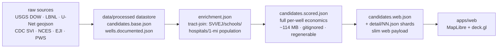

# Lost Wells — Product Overview

> Read-it-in-5-minutes overview of what Lost Wells is, the numbers behind it,
> how the pipeline works, and what is real vs. placeholder. For the full
> system design see [`ARCHITECTURE.md`](./ARCHITECTURE.md); for an honest
> build-session self-audit see [`../PROGRESS.md`](../PROGRESS.md).

## What it is

Lost Wells is a platform that **discovers and ranks undocumented, orphaned oil
& gas wells by human and climate impact** — so the finite **$4.7B federal
plugging fund** can be aimed at the wells that hurt people most.

There are an estimated **310,000–800,000 undocumented orphaned wells** in the
U.S., versus only **117,672 documented** ones. For the undocumented majority,
human exposure is literally uncounted: wells sit under a school gym or feet from
a family's drinking water with no record at all. Lost Wells finds candidate
undocumented wells, enriches each with the human/climate context around it,
scores them on a transparent composite, and serves an interactive map +
per-well dossiers.

## The numbers

| Metric | Value |
|---|---|
| Candidate (undocumented) wells | **~38,222** across CA, OK, PA, WV, OH, KY |
| Documented USGS backbone wells | **117,672** |
| Composite score min / median / max | **21.7 / 51.9 / 79.6** |
| Scoring metrics / groups | **9 metrics** across **4 groups** |
| Engine unit tests | **25 passing** |

Candidate provenance: **1,303** LBNL CA/OK detections + **36,919** U-Net
Appalachia detections (PA/KY/WV/OH), merged into one universe.

## How it works (4 stages)

```
1. INGEST    services/ingest/    Pull USGS DOW + LBNL + CDC SVI + NCES once -> committed datastore
2. ENRICH    services/ingest/    Tract-join SVI / EJ / schools / hospitals / 1-mi population
3. SCORE     services/engine/    9 metrics / 4 groups -> percentile-rank composite
4. SERVE     apps/web/           Next.js + MapLibre GL + deck.gl interactive map + dossiers
```

Plus two optional, out-of-band capabilities:
- **U-Net candidate detection** (`UNET/`) — the real, runnable LBNL inference
  pipeline (`UNET/unet/infer.py`) to expand the candidate universe beyond the
  current 6 states (GPU host required). `services/unet/infer.py` is a superseded
  sketch — `UNET/` is authoritative for inference.
- **LangGraph AI dossier swarm** (`services/swarm/`) — Claude + web-search
  investigators that build a per-well dossier (operator history, bankruptcy
  leads, local news). Run via CLI; results cached.

The design principle throughout is **ingest-once, serve-from-cache**: the web
app reads committed JSON in `data/processed/`, with no live backend.

## Data flow



`candidates.scored.json` is the intermediate full-economics file. It is **>100
MB and gitignored** (exceeds GitHub's limit) — it is regenerated from the
committed base + enrichment via `services/engine/score_candidates.py`, which
then emits the slim `candidates.web.json` + `detail/NN.json` shards the web app
actually loads (the Phase 4 slim-payload pattern).

## What's real vs. placeholder

**Real / shipped:**
- Enrichment coverage on the scored universe (SVI, EJ, schools, hospitals,
  1-mile population — full coverage on CA/OK, tract-join coverage on the 38k).
- The transparent percentile-rank composite scorer (9 metrics, 25 unit tests).
- The slim web payload + lazy per-well detail shards (Phase 4).
- The interactive map and dossier UI.

**Placeholder / partial:**
- **`program_match`** — degenerate (uniq=1 across all wells); already
  down-weighted to **0.05** in Phase 5. It is a placeholder hook for real
  state-program eligibility, not a bug.
- **`super_emitter` / `heroes.super_emitter`** — `data/processed/*.json` exist
  but are empty (`{}`). They are **live scoring inputs** (read by
  `score_candidates.py`) and back a real UI feature (the "EPA super-emitter
  nearby" badge in `DossierPanel.tsx`); they currently produce no flags because
  `super_emitter.py` hasn't been run with data. Harmless empty default — not
  dead code.
- **AI dossier swarm** — architecture intact and previously run live, but **not
  re-run** against the new top-N after the Phase 5 rescore.
- **U-Net inference** — documented and runnable but **not executed in this env**
  (no GPU); the Appalachia candidates came from pre-computed detections.

## Oddities & future risks

Ranked by how likely they bite a future developer.

**Will-bite-soon**
- **Stray root GeoJSON** (8–30 MB scratch files) used to sit untracked in the
  repo root. They are now deleted and `/*.geojson` is gitignored, so a stray
  `git add .` can't re-introduce the 100 MB-class problem.
- **`candidates.scored.json` is gitignored but required to regenerate the web
  payload** (114 MB). A fresh clone has no data until ingest + score are run —
  the regeneration command is documented in `README.md` and `CLAUDE.md`.

**Latent / structural**
- **Two U-Net trees**: `UNET/` (the real, runnable inference pipeline + research
  + EDX dataset notes) vs `services/unet/` (a superseded inference sketch).
  Different lifecycles, intentionally not merged — **`UNET/unet/infer.py` is
  authoritative for inference**; `services/unet/infer.py` is the older sketch.
  Cross-linked in `CLAUDE.md`.
- **Four+ separate `requirements.txt`** (ingest, engine, swarm, unet, plus
  `UNET/`) with no lock files, no `pyproject.toml`, no Python version pin, and
  GDAL/geopandas documented only in prose. Packaging consolidation is a known
  gap (see next steps).
- **No CI, no linters, no Makefile.** 25 engine tests exist but nothing runs
  them automatically.
- **`program_match` is degenerate** (uniq=1) — placeholder, already
  down-weighted (see above).

## Next steps

- **Add minimal CI**: `pytest services/engine/tests` + `tsc --noEmit` / build
  on PR.
- **Consolidate Python deps** into a `pyproject.toml` (or a top-level
  `requirements.txt` with extras) and pin Python + GDAL/geopandas.
- **Resolve `program_match`** (real state-program eligibility) or remove the
  metric.
- **Populate or remove `super_emitter` / `heroes.super_emitter`** outputs.
- **Re-run the AI dossier swarm** against the new top-N and wire dossiers into
  the `DossierPanel`.
- **Run U-Net inference on GPU** to expand candidates beyond the current 6
  states.
- **Document a one-command bootstrap** (`make data` / script) so a fresh clone
  can regenerate `candidates.scored.json` → web payload.
